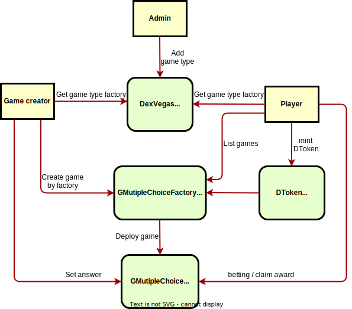

## DexVegas 

This project goal is to become a **Game as a Service (GaaS)** platform.

## Description

User can create their own game content based on the platform supported game types.

## Introduction

There are 3 main components in the DexVegas:

1. ```DexVegas```: It is a game lobby where you can browse through different types of games and choose the ones you are interested in to play.
2. ```DToken```: A gaming token follow ERC20. It needs to be exchanged with a underlying token for DToken, which is used for buying and selling items within the game.
3. ```Game```: A game needs to consist of two parts: the factory contract for establishing the game and the contract for the game content. Currently we have multiple-choice betting game type.
- Factory: User can create new game content through the factory contract, allowing players to participate in the game established.
- Content: The game content contract is a template. When the user creates a new game, they must provide specific game content. Players interact with the game through the game content contract.

## Features

### DexVegas.sol

- Add new game type
- List game type info, ex: name and factory

### DToken.sol

- ERC20 token
- Set underlying token and exchange rate between DToken
- Mint DToken
- Redeem underlying token by DToken
- Flashloan underlying token 
- Earn fee from the flashloan amount

### GMutipleChoiceFactory.sol

Anyone can use the factory to create multiple-choice betting games and set the game rules, content by their need.

- Creating games
- Setting options
- Setting player whitelist
- Setting minimum and maximum betting amount
- Setting start and close betting time, lottery draw time
- Games created by normal user have a player upper limit
- Admin user can create game without player upper limit
- List all multiple-choice betting games

### GMultipleChoice.sol

This is a multiple-choice betting game. Game creator will set the options, players can choose one option to betting.

- Player can betting and get a NFT token as a lottery ticket
- Setting answer: Game creator can set answer after lottery draw time
- Game creator earn fee: Get part of fee from the total betting amount
- GMutipleChoiceFactory earn fee: Get part of fee from the total betting amount
- Winner claim award
- Parimutuel betting: Using parimutuel betting method to distribute award

## Flowchart



## Usage

### Install

```shell
$ forge install
```

### Build

```shell
$ forge build
```

### Test

```shell
$ forge test
```

### Deploy

* Create `.env` in the project and set following variable

```
# your private key
P_KEY = 0x0123....
```

* Update foundry.toml to replace SEPOLIA_RPC_URL & ETHERSCAN_API_KEY to your information

* run the following command to deploy DexVegas contract

```shell
$ forge script script/Deploy.s.sol:DexVegasScript --rpc-url "${RPC_URL}" --broadcast --verify
````

## Future work

- Share flashloan fee with DToken holders.
- Governance
  - Provide governance token for game players and creators
  - Participants can propose what type of game they want to add
